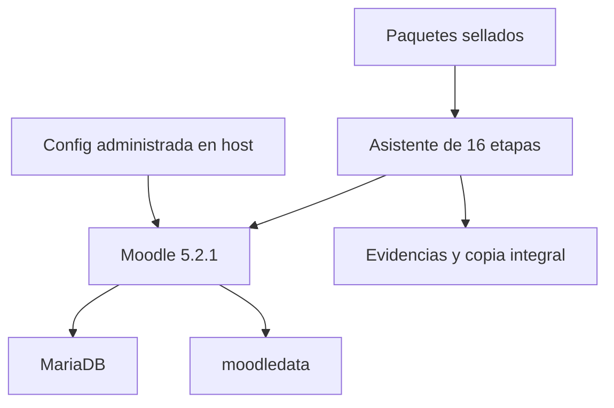
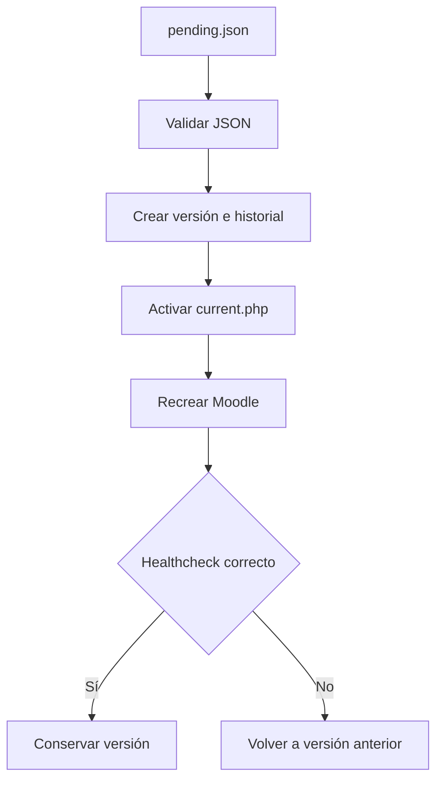

# Consolidador Moodle UFPS — Linux

Versión `7.2.1-linux-rc6`.

Herramienta para consolidar entre 2 y 32 paquetes de origen sellados en un
Moodle 5.2.1 nuevo, ejecutado con Docker sobre Linux/Ubuntu.

El proceso concilia identidades, conserva vínculos OAuth verificables, normaliza
roles, restaura primero un curso piloto, procesa después el lote completo y
genera evidencias y una copia integral sellada.

> Esta es una versión candidata. Debe completar una ejecución integral en el
> entorno institucional de ensayo antes de autorizarse para producción.

## Alcance

La distribución incluye:

- Moodle 5.2.1 fijado mediante imagen Docker construida localmente.
- MariaDB 11.4 para el destino.
- Motor de consolidación de 16 etapas.
- Conciliación de identidades, roles y matrículas.
- Configuración manual y validación de Google OAuth2.
- Curso piloto previo al lote masivo.
- Checkpoints reanudables.
- Ejecución interactiva o automática en segundo plano.
- Notificaciones SMTP opcionales.
- Evidencias, reportes y copia integral final.
- Gestor persistente y versionado de ajustes de `config.php`.

La distribución no incluye:

- Herramientas para generar los paquetes de origen.
- Credenciales, `.env`, paquetes institucionales o resultados anteriores.
- Registro de dominio, DNS, proxy TLS o certificados.
- Creación o edición automática del cliente OAuth en Google Cloud.
- Plugins de terceros de las instancias de origen.
- Aprobación automática de conflictos que requieren decisión institucional.

## Compatibilidad de entrada

La RC6 exige paquetes producidos con el contrato esperado por el Recolector
`7.2.1-linux-rc2`:

- `package_type=moodle-consolidation-source`.
- `schema_version=1.0`.
- `package_status=sealed`.
- `identity_schema_version=1.2`.
- `identity_scope=all` para producción.
- `source_id` válido y único.

El Consolidador confía en el paquete sellado y conserva defensas de estructura,
manifiesto y rutas. No repite automáticamente la auditoría exhaustiva de todos
los hashes internos ni relee cada `.mbz`; esa auditoría pertenece al flujo del
Recolector.

## Arquitectura



Docker utiliza el proyecto fijo:

```text
moodle-consolidation-production
```

Servicios principales:

| Servicio | Uso |
|---|---|
| `db` | Base MariaDB del destino. |
| `moodle-target` | Sitio Moodle 5.2.1 consolidado. |
| `moodle-cron` | Cron normal, activado después de publicar. |
| `assistant-runtime` | Runtime aislado del asistente y sus validaciones. |

Volúmenes:

| Volumen | Contenido |
|---|---|
| `db_data` | Base de datos. |
| `target_code` | Código Moodle y `config.php`. |
| `target_data` | `moodledata`. |

Los ajustes administrados de `config.php` no viven en esos volúmenes. Su fuente
se conserva en el host mediante `MOODLE_MANAGED_CONFIG_DIR`.

## Requisitos

- Linux/Ubuntu de 64 bits.
- Docker Engine operativo.
- Docker Compose v2, mediante `docker compose`.
- Usuario autorizado para usar Docker.
- `flock`, incluido normalmente en `util-linux`.
- Conectividad de salida durante la construcción inicial de imágenes.
- Espacio para ZIP originales, copias de trabajo, backups normalizados, base de
  datos, `moodledata` y copia integral final.
- Dominio definitivo y acceso administrativo al proyecto Google Cloud.
- Proxy TLS institucional si la URL pública usa HTTPS.
- Servidor SMTP accesible si se habilitan notificaciones.
- Directorio persistente y protegido en el host para la configuración
  administrada.

La advertencia de menos de 20 GiB es informativa. No existe un tope artificial
de bytes por curso o paquete; la capacidad real queda limitada por disco,
filesystem, Docker, base de datos y Moodle.

## Estructura

```text
copias/                       ZIP sellados de entrada
config/                       Políticas y resoluciones manuales
config-manager/               Motor del gestor de config.php
docker/                       Imagen Moodle y runtime
exports/                      Resultados, checkpoints y copia integral
reports/                      Logs, estados e instrucciones
scripts/                      Motor de las 16 etapas
.env                          Configuración local; se crea y no se versiona
moodle-consolidation.sh       Comando principal
CONFIGURAR.sh                 Asistente de configuración inicial
PREPARAR-DESTINO.sh           Construcción e instalación del destino
INICIAR-CONSOLIDACION.sh      Ejecución interactiva
INICIAR-SEGUNDO-PLANO.sh      Ejecución automática
ESTADO.sh                     Estado de contenedores y asistente
DETENER.sh                    Detención conservando volúmenes
PUBLICAR-SITIO.sh             Validación y activación de cron
GESTIONAR-CONFIG.sh           Ajustes persistentes de config.php
```

## Instalación inicial

Use una extracción nueva de la distribución en el servidor de ensayo. No copie
`.env`, `exports/`, `reports/`, `managed-config/` o checkpoints de otra prueba.

Desde la raíz:

```bash
chmod +x ./*.sh config-manager/*.sh docker/*.sh
cat VERSION.txt
./moodle-consolidation.sh verificar
```

Debe mostrar:

```text
7.2.1-linux-rc6
INTEGRIDAD_OK
```

La verificación comprueba `FILES.sha256` y los archivos requeridos del motor.

> `README.md` forma parte de `FILES.sha256` en la distribución RC6. No edite
> archivos dentro de un paquete de entrega ya sellado. Una actualización de
> documentación integrada al paquete requiere generar nuevamente la
> distribución y su manifiesto de integridad.

## Configuración

Ejecute:

```bash
./CONFIGURAR.sh
```

El asistente solicita:

- URL pública definitiva.
- Correo y usuario del administrador Moodle.
- Contraseña administrativa o autorización para generar una.
- Puerto HTTP local, `8090` por defecto.
- Activación opcional de correos.
- Destinatario y remitente SMTP autorizado.
- Host, puerto, usuario, contraseña y uso de TLS/STARTTLS.
- Ruta absoluta persistente para los ajustes administrados.

El resultado se guarda en `.env` con permisos `600`. Si el archivo ya existe,
la herramienta no lo sobrescribe.

Cuando la URL inicia con `https://`, el sitio escucha en
`127.0.0.1:<puerto>` y espera un proxy TLS institucional. Esa dirección local no
reemplaza la URL pública.

Las credenciales SMTP se guardan en `.env` codificadas en base64. Base64 no es
cifrado; el archivo debe permanecer restringido y fuera de Git.

Al finalizar, `CONFIGURAR.sh` ofrece preparar el destino inmediatamente. Si se
responde que no:

```bash
./PREPARAR-DESTINO.sh
```

## Preparación del destino

`PREPARAR-DESTINO.sh`:

1. Verifica Docker, Compose, permisos y espacio.
2. Construye las imágenes fijadas de Moodle y del asistente.
3. Inicializa la primera configuración declarativa.
4. Arranca MariaDB.
5. Instala Moodle 5.2.1.
6. Inicia `moodle-target`.
7. Espera un healthcheck correcto.

Resultado esperado:

```text
DESTINO_LISTO url_publica=... version=5.2.1
```

Comprobar el estado:

```bash
./ESTADO.sh
```

## Paquetes de entrada

Coloque entre 2 y 32 ZIP en `copias/`:

```text
copias/virtual.zip
copias/maestrias.zip
copias/presencial.zip
```

Antes de copiarlos, verifique en un directorio externo sus hashes de transporte:

```bash
sha256sum -c virtual.zip.sha256
sha256sum -c maestrias.zip.sha256
sha256sum -c presencial.zip.sha256
```

Cada `source_id` debe ser único. No se admiten dos paquetes para el mismo
origen.

El límite `maximum_entries_per_package=100000` es una defensa estructural sobre
la cantidad de entradas del ZIP; no limita el tamaño de archivos o cursos.

Después de la primera intención de escritura en el destino, no agregue, retire
ni sustituya ZIP. El bloqueo queda registrado en:

```text
reports/destination-write.lock.json
```

## Ejecución interactiva

```bash
./INICIAR-CONSOLIDACION.sh
```

En cada etapa se ofrecen:

```text
continuar | reintentar | abrir | salir
```

- `continuar`: ejecuta la etapa pendiente.
- `reintentar`: vuelve a evaluar una etapa después de corregir su causa.
- `abrir`: muestra los archivos de revisión asociados.
- `salir`: pausa y conserva los checkpoints.

Para reanudar:

```bash
./INICIAR-CONSOLIDACION.sh
```

El asistente comienza en la primera etapa que aún no tenga evidencia aprobada.

## Ejecución automática en segundo plano

```bash
./INICIAR-SEGUNDO-PLANO.sh
```

El lanzador intenta usar una unidad `systemd` del usuario. Si no está
disponible, usa `nohup`.

El retraso entre etapas se controla en `.env`:

```text
CONSOLIDATION_AUTO_DELAY_SECONDS=15
```

Valores admitidos: `0` a `3600` segundos.

En modo automático:

- Cada etapa habilita la siguiente únicamente si su validación queda aprobada.
- Un fallo o conflicto detiene el flujo con estado `blocked`.
- La configuración manual OAuth pausa con estado `waiting_manual`.
- Al corregir la causa, repita `./INICIAR-SEGUNDO-PLANO.sh`.
- Los checkpoints aprobados se conservan.

Seguimiento:

```bash
./ESTADO.sh
./moodle-consolidation.sh logs
tail -F reports/asistente-consolidacion.log
```

Si el runner usa `systemd`, consulte el nombre real y siga su log:

```bash
UNIT="$(sed -n '1p' reports/background-unit.txt)"
journalctl --user -u "${UNIT}.service" -f
```

Si usa `nohup`:

```bash
tail -F reports/consolidacion-segundo-plano.log
```

## Detención y reanudación de servicios

Detención controlada:

```bash
./DETENER.sh
```

El comando detiene el asistente en segundo plano, cron, Moodle y MariaDB, pero
conserva:

- Volúmenes Docker.
- ZIP de entrada.
- Resultados y evidencias.
- Checkpoints.
- Configuración administrada del host.

Para levantar nuevamente el destino conservado:

```bash
./PREPARAR-DESTINO.sh
```

Después reanude el modo que corresponda:

```bash
./INICIAR-CONSOLIDACION.sh
```

o:

```bash
./INICIAR-SEGUNDO-PLANO.sh
```

No elimine volúmenes para solucionar un bloqueo de una etapa. La eliminación de
volúmenes borra la base, el código, `moodledata`, OAuth y todo avance del
destino; solo corresponde a una prueba que se haya decidido descartar por
completo.

## Notificaciones SMTP

La configuración se realiza durante `CONFIGURAR.sh`. Se solicita por separado:

- Destinatario de las notificaciones.
- Remitente autorizado por el proveedor.
- Host y puerto SMTP.
- Credenciales, si el relay requiere autenticación.
- Uso de TLS/STARTTLS.

Se notifican:

- Inicio o reanudación.
- Terminación correcta de una etapa.
- Fallo o conflicto bloqueante.
- Necesidad de intervención manual.
- Aplicación o reversión del gestor de configuración.
- Cierre completo.

Un fallo SMTP se registra, pero no convierte una etapa correcta en fallida. Los
archivos en `reports/` continúan siendo la evidencia oficial.

## Configuración manual de Google OAuth2

La etapa 3 genera:

```text
reports/oauth2-configuracion-manual.txt
reports/oauth2-validacion.txt
exports/oauth2/validation.json
```

El administrador debe:

1. Registrar en Google Cloud la URI exacta indicada, con forma:

   ```text
   https://dominio-final/admin/oauth2callback.php
   ```

2. Abrir en Moodle:

   ```text
   Administración del sitio > Servidor > Servicios OAuth 2
   ```

3. Crear o editar el servicio Google institucional.
4. Introducir `Client ID` y `Client secret` directamente en Moodle.
5. Habilitar el servicio y mostrarlo en la página de acceso.
6. Habilitar el método en:

   ```text
   Plugins > Autenticación > Gestionar autenticación
   ```

7. Reanudar el Consolidador.

La herramienta no solicita, lee ni guarda el `Client ID` o el `Client secret`.

Si Moodle contiene más de un servicio Google, defina el `issuer_id` seleccionado
en:

```text
config/oauth2.json
```

No escriba secretos en ese archivo.

El proceso diferencia:

- `google_sub` comprobado.
- Correo que Moodle utiliza realmente como linked username OAuth.
- Identificadores opacos o ambiguos que requieren revisión.

Un correo nunca se inventa ni se escribe como `google_sub`.

La validación automática no sustituye una autenticación real. Antes de publicar,
pruebe el acceso con cuentas representativas de estudiante, docente y gestor.

## Las 16 etapas

| Etapa | Operación | Escribe en destino |
|---:|---|:---:|
| 1 | Importar paquetes y validar el contrato sellado. | No |
| 2 | Comprobar Moodle y compatibilidad de plugins. | No |
| 3 | Configurar y validar manualmente Google OAuth2. | No |
| 4 | Conciliar identidades, roles y matrículas. | No |
| 5 | Simular usuarios canónicos. | No |
| 6 | Aplicar usuarios y linked logins Google. | Sí |
| 7 | Verificar usuarios y linked logins. | No |
| 8 | Preparar y simular el curso piloto. | No |
| 9 | Restaurar el piloto. | Sí |
| 10 | Verificar el piloto. | No |
| 11 | Simular el lote consolidado. | No |
| 12 | Preparar backups derivados con checkpoints. | No |
| 13 | Aplicar el lote secuencialmente. | Sí |
| 14 | Verificar la consolidación completa. | No |
| 15 | Consolidar evidencias y cerrar. | No |
| 16 | Generar y sellar la copia integral del sitio. | Sí |

El curso piloto se selecciona automáticamente. Si ya fue restaurado y la
verificación se interrumpió, la RC6 lo reconoce y reanuda sin crear una segunda
copia.

## Conciliación de identidades

Los informes principales se generan en:

```text
exports/phase3/identity_conflicts.csv
exports/phase3/role_classification_exceptions.csv
exports/phase4/target_user_plan.csv
exports/phase4/verification.csv
exports/phase4/verification.json
```

Las decisiones manuales de identidad se registran únicamente en:

```text
config/identity_resolutions.csv
```

No modifique los inventarios generados para ocultar un conflicto. La resolución
debe incluir responsable, fecha UTC, evidencia y justificación conforme a las
columnas de la plantilla.

Cuando dos orígenes confirman el mismo emisor y linked username OAuth con forma
de correo, el Consolidador puede fusionar por `emisor + correo normalizado`,
incluso para dominios personales. Las ambigüedades reales continúan bloqueadas.

Los dominios institucionales autorizados se declaran para trazabilidad en:

```text
config/identity-policy.json
```

La distribución UFPS incluye `ufps.edu.co`. Si cambia la política institucional,
actualice ese archivo antes de iniciar la conciliación.

## Roles

La política normaliza:

| Rol de origen | Rol objetivo |
|---|---|
| Estudiante | `student` |
| Docente | `editingteacher` |
| Administrador funcional | `manager` |
| Rol no estándar | `personalizado` de solo lectura en cursos |

`siteadmin` se conserva como privilegio de sitio y nunca se retira de los
administradores que ya existen en el destino.

Las excepciones de normalización masiva se resuelven en:

```text
config/phase6-role-resolutions.csv
```

Revise los planes en:

```text
exports/phase6/role_normalization.csv
exports/phase6/course_plan.csv
exports/phase6/category_plan.csv
exports/phase6/identity_convergence.csv
```

## Cursos y nombres duplicados

- Los `shortname` no conflictivos se conservan.
- Las colisiones de `shortname` se desambiguan con el identificador del origen.
- El nombre completo se conserva cuando es único.
- Si dos cursos comparten nombre, el objetivo usa:

  ```text
  [Instancia de origen] Nombre original
  ```

Las decisiones quedan auditadas en `exports/phase6/course_plan.csv`.

## Plugins

La etapa 2 genera:

```text
exports/phase2/plugin_compatibility.csv
exports/phase2/plugin_compatibility.json
```

Un plugin utilizado por un curso y ausente en Moodle 5.2 bloquea el proceso.
Instale únicamente una versión compatible, conservando su ruta Moodle:

```text
docker/custom-plugins/mod/nombre_plugin/
docker/custom-plugins/auth/nombre_plugin/
docker/custom-plugins/local/nombre_plugin/
docker/custom-plugins/theme/nombre_plugin/
```

Después de agregar o actualizar un plugin:

```bash
./PREPARAR-DESTINO.sh
```

La imagen se reconstruye y la etapa de compatibilidad debe ejecutarse
nuevamente. No copie plugins de Moodle 4.5 sin comprobar que exista una versión
compatible con Moodle 5.2.

## Gestión persistente de `config.php`

`GESTIONAR-CONFIG.sh` es una utilidad autónoma incluida en la misma distribución,
pero no forma parte de las 16 etapas.

No es un editor libre de PHP. Administra propiedades `$CFG` declaradas en JSON,
las compila de forma determinista, crea historial, valida hashes y permite
reversión automática.

### Cómo actúa



El `config.php` raíz incluye, antes de `lib/setup.php`, una carga controlada de:

```text
/var/www/html/.managed-config.php
```

La fuente real vive fuera de los volúmenes Docker, en la ruta absoluta definida
por:

```text
MOODLE_MANAGED_CONFIG_DIR
```

El directorio se monta en `/run/moodle-config` como solo lectura. Al arrancar,
el contenedor verifica el manifiesto y copia la versión activa con propietario
`root:www-data` y modo `0640`.

### Comandos

Ayuda:

```bash
./GESTIONAR-CONFIG.sh ayuda
```

Inicialización, normalmente ejecutada por `PREPARAR-DESTINO.sh`:

```bash
./GESTIONAR-CONFIG.sh inicializar
```

Consultar la capa activa:

```bash
./GESTIONAR-CONFIG.sh ver
```

Crear una propuesta:

```bash
EDITOR=nano ./GESTIONAR-CONFIG.sh editar
```

Ejemplo de `pending.json`:

```json
{
  "schema_version": "1.0",
  "settings": {
    "debugdisplay": false,
    "sessiontimeout": 7200
  }
}
```

Aplicar con motivo obligatorio:

```bash
./GESTIONAR-CONFIG.sh aplicar \
  --motivo "Aumentar el tiempo de sesión institucional"
```

Consultar historial:

```bash
./GESTIONAR-CONFIG.sh historial
```

Restaurar una versión como un cambio nuevo y auditado:

```bash
./GESTIONAR-CONFIG.sh restaurar \
  20260808T220000Z-a1b2c3d4e5f6 \
  --motivo "Reversión solicitada por administración"
```

Verificar hashes, montaje y permisos:

```bash
./GESTIONAR-CONFIG.sh verificar
```

Resultados esperados:

```text
CONFIG_ADMINISTRADA_OK version=... status=...
MONTAJE_CONFIG_OK solo_lectura=1 proceso_web_sin_escritura=1
```

### Tipos permitidos

Los valores pueden ser:

- Booleanos.
- Enteros o decimales.
- Cadenas.
- `null`.
- Listas y objetos JSON.

Use `false`, no `"false"`, cuando el valor deba ser booleano.

No se permite PHP arbitrario, llamadas a funciones, `require` ni instrucciones
ejecutables.

### Variables reservadas

No pueden administrarse mediante este mecanismo:

```text
dbtype
dblibrary
dbhost
dbport
dbname
dbuser
dbpass
prefix
dboptions
dataroot
wwwroot
dirroot
libdir
reverseproxy
sslproxy
admin
```

Esas variables pertenecen a la configuración base, `.env` y el arranque del
contenedor.

### Persistencia y respaldo

La configuración administrada sobrevive a:

- Reinicios del contenedor.
- Recreación de `moodle-target`.
- Reconstrucción de la imagen.
- Recreación de `target_code` o `target_data`.

No sobrevive si se elimina el directorio del host configurado en
`MOODLE_MANAGED_CONFIG_DIR`. Inclúyalo en el respaldo administrativo seguro del
servidor.

La copia integral de fase 8 solo incluye un manifiesto sin valores; no sustituye
el respaldo de este directorio.

### Lectura completa de `config.php`

`./GESTIONAR-CONFIG.sh ver` muestra únicamente la capa administrada. Para leer el
`config.php` completo, localice el contenedor y consulte el archivo sin
modificarlo:

```bash
TARGET_ID="$(
  docker ps \
    --filter label=com.docker.compose.project=moodle-consolidation-production \
    --filter label=com.docker.compose.service=moodle-target \
    --format '{{.ID}}' |
  sed -n '1p'
)"

test -n "$TARGET_ID" &&
docker exec -u root "$TARGET_ID" cat /var/www/html/config.php
```

Leer la copia administrada cargada:

```bash
docker exec -u root "$TARGET_ID" \
  cat /var/www/html/.managed-config.php
```

Estos comandos son de solo lectura. `config.php` contiene la contraseña de la
base de datos; no copie su salida a chats, reportes o canales no autorizados.

## Evidencias y resultados

Rutas principales:

```text
reports/assistant-state.json
reports/asistente-consolidacion.log
exports/phase3/
exports/phase4/
exports/phase5/
exports/phase6/
exports/phase7/informe-final-migracion.md
exports/phase7/closure_summary.json
exports/phase8/paquete-sitio-consolidado.zip
exports/phase8/paquete-sitio-consolidado.sha256.txt
```

El estado del asistente puede ser:

| Estado | Significado |
|---|---|
| `running` | Etapa en ejecución. |
| `completed` | Etapa o proceso aprobado. |
| `paused` | Pausa solicitada por el operador. |
| `waiting_manual` | Requiere configuración o decisión administrativa. |
| `blocked` | Fallo o conflicto impide continuar. |

## Cierre y publicación

La consolidación debe terminar con:

```text
CONSOLIDATION_ASSISTANT_OK
```

Antes de publicar, revise:

- `exports/phase7/informe-final-migracion.md`.
- `exports/phase7/closure_summary.json`.
- Verificación OAuth2 con cero vínculos pendientes.
- Hash de la copia integral de fase 8.
- Pruebas reales de inicio de sesión.
- Pruebas funcionales representativas de cursos, archivos, actividades y roles.

Publicar:

```bash
./PUBLICAR-SITIO.sh
```

El comando exige:

- Cierre en estado `evidence_consolidated`.
- Cero linked logins OAuth fallidos.
- Copia integral sellada y SHA-256 correcto.
- Configuración administrada válida.
- Validación en vivo del proveedor OAuth2.

Solo después activa `moodle-cron`.

Resultado esperado:

```text
SITIO_PUBLICADO cron_normal_activo=1 url=...
```

## Copia integral

La fase 8 genera:

```text
exports/phase8/paquete-sitio-consolidado.zip
```

Incluye:

- Base de datos.
- Código y plugins.
- `moodledata`.
- Evidencias de la migración.
- Manifiesto no sensible de la configuración administrada.

Excluye:

- `config.php`.
- `.env`.
- Credenciales de conexión.
- Valores de la configuración administrada.

Aunque excluya esos secretos, contiene información institucional sensible y
debe custodiarse como un respaldo completo.

## Seguridad y archivos que no deben versionarse

No suba a Git:

```text
.env
copias/*.zip
exports/
reports/
managed-config/
```

No publique:

- `config.php` o `.managed-config.php` reales.
- Credenciales SMTP, Google o de base de datos.
- Dumps, `.mbz`, archivos de usuarios o copia integral.
- Resoluciones diligenciadas con datos personales.

Los archivos de resolución dentro de `config/` deben permanecer en el
repositorio únicamente como plantillas vacías. Para una ejecución real,
custodie las versiones diligenciadas junto con las evidencias restringidas.

## Solución de problemas

### `INTEGRIDAD_OK` no aparece

No continúe. Compruebe si la distribución fue extraída completamente o si algún
archivo cubierto por `FILES.sha256` fue editado:

```bash
sha256sum --check FILES.sha256
```

Use una extracción nueva del paquete oficial si existe una diferencia.

### Faltan paquetes o hay demasiados

El asistente exige entre 2 y 32 archivos `copias/*.zip`.

```bash
find copias -maxdepth 1 -type f -name '*.zip' -printf '%f\n' | sort
```

### Estado `waiting_manual`

Revise las rutas indicadas en `reports/assistant-state.json`. Para OAuth2:

```text
reports/oauth2-configuracion-manual.txt
reports/oauth2-validacion.txt
```

Complete la configuración en Moodle y vuelva a iniciar el modo elegido.

### Estado `blocked`

```bash
./ESTADO.sh
./moodle-consolidation.sh logs
```

Revise `review_paths` dentro de `reports/assistant-state.json`. Corrija la causa
y reanude; no elimine checkpoints aprobados.

### Plugin ausente o incompatible

Revise:

```text
exports/phase2/plugin_compatibility.csv
```

Instale una versión compatible en `docker/custom-plugins/`, prepare de nuevo el
destino y repita la etapa.

### Ejecución en segundo plano no inicia

Compruebe que no exista otro asistente activo:

```bash
./ESTADO.sh
```

Revise también:

```text
reports/background-unit.txt
reports/background.pid
reports/consolidacion-segundo-plano.log
```

### Moodle no recupera salud después de un ajuste

El gestor intenta volver automáticamente a la versión anterior. Revise:

```bash
./GESTIONAR-CONFIG.sh historial
./moodle-consolidation.sh logs
```

No edite `active`, `history/`, `current.php` o `.managed-config.php`
manualmente.

### Permisos en `exports/`

La RC6 intercambia de forma controlada los permisos entre el operador y
`www-data`. Evite aplicar cambios recursivos manuales mientras el asistente está
activo. Use el mensaje y la etapa exacta para diagnosticar cualquier bloqueo.

## Referencia rápida

```bash
# Integridad y preflight
./moodle-consolidation.sh verificar
./moodle-consolidation.sh preflight

# Configuración y destino
./CONFIGURAR.sh
./PREPARAR-DESTINO.sh

# Ejecución
./INICIAR-CONSOLIDACION.sh
./INICIAR-SEGUNDO-PLANO.sh

# Supervisión
./ESTADO.sh
./moodle-consolidation.sh logs
tail -F reports/asistente-consolidacion.log

# Detención conservando estado
./DETENER.sh

# Configuración persistente
./GESTIONAR-CONFIG.sh ver
./GESTIONAR-CONFIG.sh editar
./GESTIONAR-CONFIG.sh aplicar --motivo "Ajuste aprobado"
./GESTIONAR-CONFIG.sh historial
./GESTIONAR-CONFIG.sh restaurar VERSION
./GESTIONAR-CONFIG.sh verificar

# Publicación
./PUBLICAR-SITIO.sh
```

## Lista de aceptación antes de producción

- Distribución con `INTEGRIDAD_OK`.
- Paquetes auditados y hashes de transporte correctos.
- Plugins utilizados compatibles con Moodle 5.2.1.
- Cero conflictos de identidad sin resolver.
- Cero decisiones de rol pendientes.
- OAuth2 configurado y validado.
- Usuarios y linked logins verificados.
- Curso piloto aprobado.
- Lote completo aprobado sin diferencias.
- Informe final revisado.
- Copia integral sellada y custodiada.
- Configuración administrada respaldada y verificada.
- Prueba real de estudiante, docente y gestor.
- DNS, TLS, proxy y monitoreo aprobados.
- Autorización institucional de publicación.
