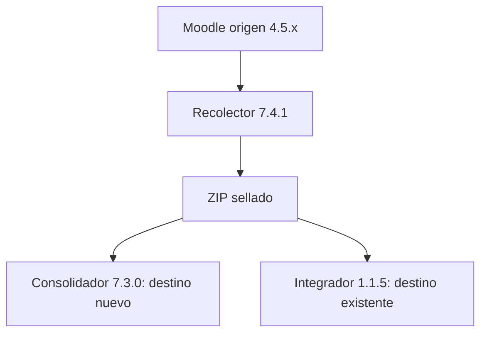

# Toolkit de consolidación e integración Moodle

Conjunto de herramientas CLI para recolectar instancias Moodle de origen,
construir un Moodle consolidado nuevo y agregar posteriormente cursos a un
destino ya consolidado. Los procesos están orientados a Linux/Ubuntu, conservan
evidencias verificables y bloquean la escritura cuando el preflight no puede
demostrar compatibilidad.

## Versiones estables

| Herramienta | Versión | Propósito | Resultado principal |
|---|---:|---|---|
| Recolector Moodle | `7.4.1-linux` | Exportar una instancia de origen sin modificarla | ZIP sellado + SHA-256 |
| Consolidador Moodle | `7.3.0-linux` | Unificar entre 2 y 32 paquetes en un destino nuevo | Moodle 5.2.1 + copia integral |
| Integrador Incremental Moodle | `1.1.5-linux` | Añadir un paquete a un destino ya consolidado | Cursos y categoría ocultos + informe final |

La compatibilidad estable es cerrada: el Consolidador y el Integrador consumen
paquetes producidos por el Recolector `7.4.1-linux`.

## Qué herramienta utilizar

| Necesidad | Flujo recomendado |
|---|---|
| Extraer cursos y datos de una instancia Moodle | Recolector |
| Crear un Moodle 5.2.1 nuevo a partir de varias instancias | Recolector en cada origen → Consolidador |
| Agregar después otra instancia o lote al Moodle ya consolidado | Recolector en el nuevo origen → Integrador Incremental |
| Modificar cursos importados anteriormente | Fuera del alcance de la V1; gestione el curso en Moodle |



## Estructura recomendada del repositorio

```text
moodle-consolidation-toolkit/
├── Recolector-v7.4.1-linux/
├── Consolidador-v7.3.0-linux/
├── Integrador-Incremental-Moodle-v1.1.5-linux/
├── releases/                    ZIP publicados y archivos .sha256
└── README.md                    Este documento
```

Cada herramienta es autónoma y mantiene su propio `README.md`, `VERSION.txt` y
`FILES.sha256`. No mezcle sus scripts ni ejecute una herramienta desde la
carpeta de otra.

## Compatibilidad

| Productor | Consumidor | Compatibilidad validada |
|---|---|---|
| Moodle origen `4.5.x` | Recolector `7.4.1-linux` | Exportación de identidades, cursos, archivos y datos académicos |
| Recolector `7.4.1-linux` | Consolidador `7.3.0-linux` | Contrato `moodle-consolidation-source` sellado |
| Recolector `7.4.1-linux` | Integrador `1.1.5-linux` | Un paquete por lote incremental |
| Consolidador `7.3.0-linux` | Integrador `1.1.5-linux` | Destino Moodle 5.2.1 configurado y publicado |

El Integrador también reconoce el destino de laboratorio
`7.3.0-linux-rc4`, pero para nuevas instalaciones se recomienda la versión
estable del Consolidador.

## Principios operativos

- El Recolector es de solo lectura sobre Moodle y produce un paquete sensible.
- Todo ZIP se trata como no confiable hasta validar estructura, rutas y sellos.
- El Consolidador crea un destino nuevo; no debe apuntarse a un Moodle en uso.
- El Integrador considera al destino existente como autoridad y no modifica
  cursos anteriores ni perfiles reutilizados.
- El correo normalizado gobierna la reutilización de identidades incrementales.
- Un `siteadmin` del origen no obtiene administración global en el destino.
- El Consolidador y el Integrador exigen copia previa y evidencias de cierre.
- Los cursos incrementales permanecen ocultos hasta su revisión manual.
- Los paquetes, `.env`, copias y reportes contienen información sensible; no
  deben subirse al repositorio.

## Inicio rápido

### 1. Recolectar una instancia

```bash
cd Recolector-v7.4.1-linux
chmod +x EXPORTAR-ORIGEN.sh VALIDAR-PAQUETE.sh

sudo ./EXPORTAR-ORIGEN.sh \
  --background \
  --workers=auto \
  --output-dir=/ruta/exportaciones \
  origen-virtual \
  /ruta/moodle/config.php
```

Resultado esperado:

```text
/ruta/exportaciones/origen-virtual.zip
/ruta/exportaciones/origen-virtual.zip.sha256
```

Consulte el README del Recolector antes de usar `--reuse-backups`,
`--reuse-only` o `--restart`.

### 2. Crear un destino consolidado

Copie entre 2 y 32 paquetes sellados en `Consolidador/copias/` y ejecute:

```bash
cd Consolidador-v7.3.0-linux/Consolidador
chmod +x ./*.sh

./moodle-consolidation.sh verificar
./CONFIGURAR.sh
./PREPARAR-DESTINO.sh
./INICIAR-CONSOLIDACION.sh --workers=auto
```

El Consolidador usa checkpoints y puede reanudar con el mismo comando. Siga las
intervenciones de identidad, OAuth2 y publicación descritas en su README.

### 3. Agregar un lote al destino existente

```bash
cd Integrador-Incremental-Moodle-v1.1.5-linux
chmod +x ./*.sh
cp /ruta/exportaciones/origen-nuevo.zip paquetes/
cp /ruta/exportaciones/origen-nuevo.zip.sha256 paquetes/

sudo ./INTEGRAR.sh \
  --workers=auto \
  --consolidador-dir=/ruta/Consolidador-v7.3.0-linux/Consolidador \
  --prebackup=existing:/ruta/copia-integral-vigente.zip \
  paquetes/origen-nuevo.zip
```

Si no existe una copia integral vigente, omita `--prebackup=existing:...`; el
Integrador generará una copia previa con `--prebackup=auto`.

Una integración correcta termina con:

```text
INCREMENTAL_INTEGRATION_OK
```

## Reanudación y diagnóstico

- Recolector: repita el mismo comando y nombre de origen.
- Consolidador: repita `./INICIAR-CONSOLIDACION.sh`.
- Integrador: repita exactamente el mismo comando y ZIP.

No borre checkpoints, temporales, cursos o volúmenes para “desbloquear” una
ejecución. Revise primero los archivos de estado y los diagnósticos de la
herramienta correspondiente.

En el Integrador:

```bash
./ESTADO.sh \
  --consolidador-dir=/ruta/Consolidador \
  origen-nuevo
```

Las evidencias quedan en:

```text
Consolidador/exports/integrator/run-origen-nuevo/
```

## Validación de las versiones publicadas

| Herramienta | Evidencia de aceptación |
|---|---|
| Recolector `7.4.1` | Paquete sellado, validación exhaustiva y checkpoints por curso |
| Consolidador `7.3.0` | Laboratorio de 2 fuentes, 15 cursos y cero diferencias |
| Integrador `1.1.5` | Dos recorridos completos; uno reanudado y otro nuevo en una sola pasada |

La aceptación del Integrador cubrió dos cursos, reutilización y colisión de
identidades, jerarquía, roles, grupos, archivos, foros, entrega, calificación e
intento de cuestionario. Ambas ejecuciones terminaron con `KIT_VERIFY_OK` y
`STABLE_TEST_OK`.

## Verificación de descargables

Cada release debe publicarse junto con su sidecar:

```bash
sha256sum -c nombre-del-paquete.zip.sha256
unzip -t nombre-del-paquete.zip
```

Después de extraer una herramienta:

```bash
cd nombre-del-paquete
sha256sum -c FILES.sha256
```

No publique `.env`, `config.php`, paquetes producidos por el Recolector,
exports, copias, logs, evidencias reales ni credenciales.

## Alcance

Este toolkit migra y agrega contenido académico mediante los mecanismos
oficiales de backup/restore de Moodle y una capa adicional de validación. No es
un sistema de sincronización continua, no reemplaza las copias institucionales
y no publica cursos automáticamente.

Para detalles de parámetros, seguridad, permisos, recuperación y evidencias,
consulte siempre el `README.md` de cada herramienta.
