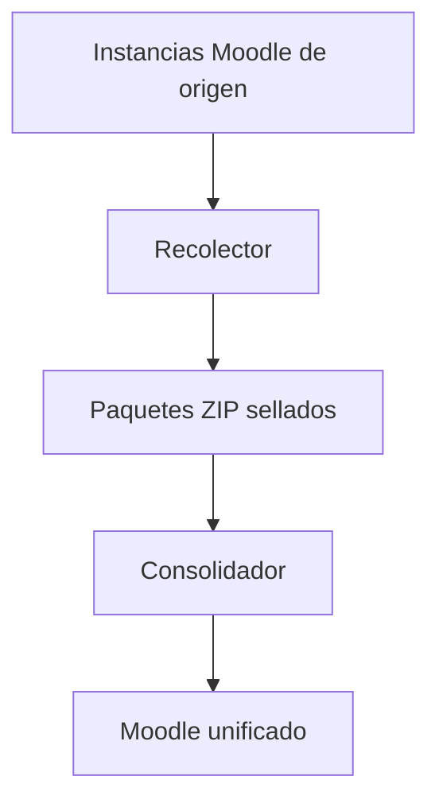

# Moodle Consolidation Toolkit

Conjunto de herramientas para extraer información de varias instancias Moodle
de origen, producir paquetes portátiles verificables y consolidarlos de forma
controlada en una única plataforma Moodle de destino.

El proyecto separa claramente dos responsabilidades:

1. **Recolector:** opera sobre cada Moodle de origen en modo de solo lectura y
   genera un ZIP sellado.
2. **Consolidador:** recibe los ZIP, concilia identidades y roles, restaura los
   cursos y verifica el resultado sobre el Moodle de destino.

Cada componente mantiene su propio manual técnico. Este README presenta la
arquitectura general, el flujo recomendado y la relación entre ambos.

## Arquitectura general



Ejemplo para tres instancias:

```text
Pregrado virtual ──→ pregrado-virtual.zip ──┐
Maestrías virtuales → maestrias.zip ─────────┼─→ Consolidador → Moodle unificado
Pregrado presencial → presencial.zip ────────┘
```

Los paquetes se procesan como artefactos de solo lectura y llevan manifiesto,
inventarios, checkpoints y hashes SHA-256 para detectar cambios o corrupción.

## Componentes del repositorio

```text
moodle-consolidation-toolkit/
├── README.md
├── recolector/
│   └── README.md
└── consolidador/
    └── README.md
```

| Componente | Responsabilidad | Documentación |
|---|---|---|
| Recolector | Extrae identidades, estructura, plugins, datos académicos y respaldos de cursos desde cada Moodle de origen. | [Manual del Recolector](./recolector/README.md) |
| Consolidador | Importa paquetes, reconcilia identidades y roles, prepara el destino, restaura cursos y ejecuta verificaciones. | [Manual del Consolidador](./consolidador/README.md) |

## Recolector estable 7.4.1

La versión estable actual del Recolector es:

```text
7.4.1-linux
```

Principales mejoras integradas:

- workers automáticos según CPU disponible, con máximo de cuatro;
- cola dinámica de cursos, sin divisiones fijas por mitades o pares/impares;
- inventario global construido una sola vez y reutilizado por los workers;
- fases detalladas, heartbeat, porcentaje, pendientes y ETA;
- correos SMTP de inicio, progreso periódico y finalización;
- fallos SMTP no bloqueantes y con diagnóstico explícito;
- corrección de la ruta efectiva de destino mediante `--output-dir`;
- almacenamiento temporal rápido opcional mediante `--temp-dir`;
- adopción de respaldos Moodle `.mbz` existentes en formato ZIP o TGZ;
- modo `--reuse-only` para impedir la regeneración de cursos;
- reanudación rápida mediante manifiesto y checkpoints;
- limpieza automática y limitada al curso que haya quedado parcial;
- copia y SHA-256 en una sola lectura;
- sellado final sin recomprimir internamente los MBZ;
- validación exhaustiva independiente del paquete generado.

La documentación completa, opciones, monitoreo y diagnóstico se encuentran en
el [README del Recolector](./recolector/README.md).

## Flujo óptimo recomendado

La generación de cada MBZ suele ser la etapa más costosa. El flujo más
eficiente consiste en adelantarla desde Moodle durante una ventana nocturna y
ejecutar después el Recolector en modo de reutilización obligatoria.

```text
Moodle genera los MBZ
        ↓
Directorio externo de respaldos
        ↓
Recolector --reuse-only
        ↓
Identidades + inventarios + checkpoints
        ↓
ZIP sellado + SHA-256
        ↓
Validación exhaustiva
        ↓
Transferencia al servidor destino
        ↓
Consolidador
```

Este camino adelanta la etapa de backup sin introducir una restauración física
completa de base de datos, `moodledata` y código. Para el flujo habitual de
consolidación no es necesario levantar una copia completa del Moodle de origen.

### 1. Generar respaldos directos de Moodle

Moodle incluye el comando oficial `admin/cli/backup.php`:

```bash
sudo -u www-data php /srv/moodle/admin/cli/backup.php \
  --courseid=123 \
  --destination=/mnt/respaldos-moodle/pregrado
```

También pueden utilizarse respaldos automáticos enviados a un directorio
externo, siempre que se compruebe que todos los cursos requeridos terminaron
como `OK` y que no fueron omitidos por reglas de cursos ocultos o sin cambios.

### 2. Ejecutar el Recolector usando únicamente los MBZ

```bash
cd /srv/moodle-consolidation-toolkit/recolector

sudo MOODLE_COLLECTOR_RUN_AS_USER=www-data \
  ./EXPORTAR-ORIGEN.sh \
  --background \
  --workers=auto \
  --notify-every=10 \
  --output-dir=/mnt/exportaciones \
  --reuse-backups=/mnt/respaldos-moodle/pregrado \
  --reuse-only \
  pregrado \
  /srv/moodle/config.php
```

Con `--reuse-only`:

- cada curso debe tener un MBZ compatible;
- el Recolector nunca genera un respaldo faltante;
- los MBZ originales no se modifican;
- cualquier rechazo identifica el curso y la causa;
- una ejecución exitosa debe terminar con `created=0` y `adopted=N`.

### 3. Validar el paquete

```bash
./VALIDAR-PAQUETE.sh \
  /mnt/exportaciones/pregrado.zip \
  /srv/moodle/config.php
```

```bash
cd /mnt/exportaciones
sha256sum -c pregrado.zip.sha256
```

No se debe transferir el paquete al destino hasta obtener:

```text
VALIDACION_OK
pregrado.zip: OK
```

### 4. Repetir por cada instancia de origen

El mismo procedimiento produce un paquete independiente por instancia:

```text
pregrado-virtual.zip
maestrias.zip
presencial.zip
```

Cada paquete conserva su identificador de origen y debe mantenerse junto a su
archivo `.zip.sha256` y reporte de validación.

### 5. Ejecutar el Consolidador

Después de validar y transferir todos los ZIP, se continúa con el flujo guiado
del Consolidador:

- validación e importación de paquetes;
- inventario conjunto de fuentes;
- conciliación de identidades;
- normalización y equivalencia de roles;
- preparación y preflight del Moodle de destino;
- validación de OAuth2;
- restauración de un curso piloto;
- restauración controlada de los cursos restantes;
- verificaciones académicas y técnicas;
- generación de reportes y evidencias finales.

Los comandos, fases y criterios de aceptación pertenecen al
[manual específico del Consolidador](./consolidador/README.md).

## Uso directo sin respaldos existentes

El Recolector puede generar los MBZ por sí mismo:

```bash
sudo ./EXPORTAR-ORIGEN.sh --background pregrado
```

Valores predeterminados:

- salida en `recolector/salidas/`;
- `config.php` en `/var/www/html/config.php`;
- workers en `auto`, máximo cuatro;
- progreso SMTP cada diez minutos si está configurado;
- almacenamiento temporal habitual de Moodle.

Para una ruta explícita:

```bash
sudo ./EXPORTAR-ORIGEN.sh --background \
  --output-dir=/mnt/exportaciones \
  pregrado \
  /srv/moodle/config.php
```

## Reanudación y recuperación

Si una ejecución se interrumpe, se repite exactamente el mismo comando con el
mismo identificador, ruta de salida y `config.php`.

El Recolector:

1. valida el manifiesto de ejecución;
2. reutiliza identidades, plugins e inventario global;
3. valida los checkpoints completos;
4. elimina únicamente el artefacto parcial del curso interrumpido;
5. continúa con los cursos pendientes;
6. sella el ZIP cuando todos los cursos terminan correctamente.

No se deben eliminar manualmente los checkpoints. `--restart` se utiliza solo
cuando se desea iniciar deliberadamente una ejecución nueva.

El Consolidador también trabaja por etapas verificables y conserva evidencia
para evitar repetir escrituras ya aprobadas. Consulte su README antes de
reiniciar o modificar una ejecución en curso.

## Integridad y trazabilidad

El flujo aplica controles en varias capas:

- SHA-256 durante la copia de cada MBZ;
- checkpoints por curso;
- manifiesto por paquete de origen;
- archivo interno `checksums.sha256`;
- SHA-256 externo del ZIP sellado;
- validador exhaustivo antes de la transferencia;
- paquetes tratados como solo lectura por el Consolidador;
- logs y estados JSON para auditoría;
- detención controlada si un artefacto cambia.

La validación del Recolector comprueba estructura, hashes, inventarios,
checkpoints, manifiesto y correspondencia de cursos. La conciliación de
identidades y las verificaciones del Moodle destino corresponden al
Consolidador.

## Identidades y OAuth2

Los paquetes conservan identidades Moodle y evidencia OAuth2 de manera
separada. El Recolector no inventa identificadores `google_sub`: solamente
declara los valores verificables disponibles en el origen.

El Consolidador utiliza las identidades de todos los paquetes para:

- detectar cuentas correspondientes a la misma persona;
- separar coincidencias ambiguas;
- preservar administradores y roles académicos;
- aplicar decisiones institucionales de conciliación;
- preparar el acceso OAuth2 en el destino.

Las fusiones dudosas deben resolverse mediante los mecanismos de revisión del
Consolidador, no editando manualmente los ZIP de origen.

## Requisitos generales

### Orígenes

- Moodle 4.5.x para el alcance probado del Recolector 7.4.1.
- PHP CLI 8.1 o posterior.
- Extensiones PHP `zip` y `dom`.
- Acceso de lectura al `config.php`, base de datos y archivos Moodle.
- Espacio suficiente para MBZ, trabajo y ZIP final.
- systemd para ejecución nativa con `--background`.

### Destino

- Servidor Linux según los requisitos del Consolidador.
- Docker Engine y Docker Compose cuando la distribución del Consolidador los
  utilice.
- Moodle destino nuevo o preparado según el manual correspondiente.
- Almacenamiento persistente y restringido.
- Acceso administrativo para OAuth2, DNS, TLS y verificaciones finales.

## Seguridad operativa

- No publicar ZIP, MBZ, inventarios ni archivos de identidad en GitHub.
- No almacenar credenciales SMTP reales dentro del repositorio.
- Proteger `smtp-config.json` con permisos restrictivos.
- Transferir paquetes por canales institucionales cifrados.
- Verificar SHA-256 antes y después de cada transferencia.
- Restringir lectura y escritura en directorios de respaldo y exportación.
- Evitar ejecutar herramientas sobre un destino con información no respaldada.
- Conservar reportes y logs requeridos como evidencia del proceso.

El repositorio debe contener únicamente código, plantillas y documentación.
Los artefactos de producción pertenecen a almacenamiento operativo protegido.

## Evidencia de aceptación del Recolector 7.4.1

La versión estable fue probada en un laboratorio con Moodle 4.5.13, PHP 8.3 y
MariaDB 10.11:

| Comprobación | Resultado |
|---|---:|
| Cursos | 12 |
| MBZ directos de Moodle | 12 |
| MBZ adoptados | 12 |
| MBZ regenerados | 0 |
| Cursos fallidos | 0 |
| Archivos internos verificados | 40/40 |
| Advertencias del validador | 0 |
| SHA-256 exterior | Correcto |

```text
EXPORT_HEARTBEAT completed=12/12 created=0 adopted=12 failed=0
RECOLECTOR_OK
VALIDACION_OK archivos=40 cursos=12 advertencias=0
laboratorio.zip: OK
```

## Alcance de la documentación

Este README global responde:

- qué problema resuelve el toolkit;
- cómo se relacionan Recolector y Consolidador;
- cuál es el flujo operativo recomendado;
- dónde consultar los comandos detallados.

Para opciones, parámetros, diagnósticos y procedimientos completos utilice:

- [README del Recolector](./recolector/README.md)
- [README del Consolidador](./consolidador/README.md)
