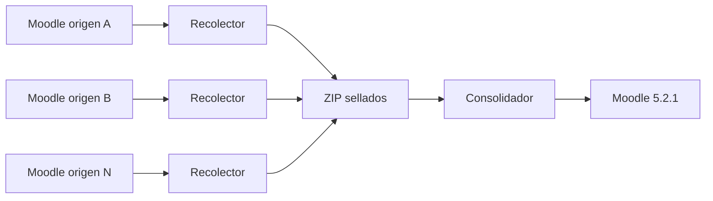

# Migración y consolidación Moodle UFPS

Herramientas para recolectar información de varias instancias Moodle de origen y
consolidarla, de forma controlada y auditable, en un Moodle 5.2.1 nuevo.

Este repositorio contiene dos componentes independientes:

| Componente | Versión de entrega | Propósito |
|---|---|---|
| [Recolector](./Recolector/README.md) | `7.2.1-linux-rc2` | Ejecutarse en cada Moodle de origen y producir un paquete ZIP sellado. |
| [Consolidador](./Consolidador/README.md) | `7.2.1-linux-rc6` | Recibir entre 2 y 32 paquetes y migrarlos a un Moodle 5.2.1 nuevo. |

> Las etiquetas `rc` identifican versiones candidatas. Antes de utilizarlas en
> producción deben completar una ejecución integral en el entorno institucional
> de ensayo, con paquetes reales, OAuth2, SMTP, plugins y pruebas funcionales.

## Objetivo

El flujo permite consolidar cursos, usuarios, vínculos OAuth, roles, matrículas,
actividades y archivos de distintas instancias sin conectar el Consolidador
directamente a las bases de datos de origen.



Cada origen se procesa de manera independiente. El Consolidador trabaja después
con los ZIP sellados y no necesita consultar nuevamente las instancias de
origen.

## Estructura esperada del repositorio

```text
.
├── README.md
├── Recolector/
│   ├── README.md
│   ├── VERSION.txt
│   ├── EXPORTAR-ORIGEN.sh
│   ├── VALIDAR-PAQUETE.sh
│   ├── smtp-config.example.json
│   └── scripts/
└── Consolidador/
    ├── README.md
    ├── VERSION.txt
    ├── CONFIGURAR.sh
    ├── PREPARAR-DESTINO.sh
    ├── INICIAR-CONSOLIDACION.sh
    ├── INICIAR-SEGUNDO-PLANO.sh
    ├── ESTADO.sh
    ├── DETENER.sh
    ├── PUBLICAR-SITIO.sh
    ├── GESTIONAR-CONFIG.sh
    ├── compose.yaml
    ├── config/
    ├── config-manager/
    ├── docker/
    └── scripts/
```

## Alcance

El proyecto incluye:

- Extracción de identidades, roles, matrículas e inventarios.
- Backups oficiales `.mbz`, uno por curso.
- Checkpoints reanudables y hashes SHA-256.
- Auditoría exhaustiva opcional de cada paquete.
- Conciliación de identidades entre orígenes.
- Conservación de vínculos Google OAuth cuando existe evidencia verificable.
- Normalización de roles y tratamiento explícito de excepciones.
- Restauración piloto antes del lote completo.
- Restauración secuencial y verificación final.
- Notificaciones SMTP opcionales.
- Ejecución interactiva o automática en segundo plano.
- Copia integral sellada del Moodle consolidado.
- Gestión persistente, versionada y reversible de ajustes de `config.php`.

El proyecto no incluye:

- Configuración automática del proyecto OAuth en Google Cloud.
- Registro de dominios, DNS, certificados TLS o proxy institucional.
- Resolución automática de conflictos que requieren decisión administrativa.
- Instalación automática de plugins de terceros no incluidos en Moodle.
- Custodia externa de credenciales o respaldos institucionales.
- Promoción automática a producción sin aprobación del administrador.

## Flujo general de operación

### 1. Preparar una ventana de recolección

Coordine una ventana de mantenimiento o de cambios congelados para cada Moodle
de origen. Los cursos se respaldan secuencialmente; si el sitio cambia durante
la ejecución, el conjunto completo no representa una instantánea atómica.

Compruebe en cada servidor:

- PHP CLI y la extensión `zip`/`ZipArchive`.
- Lectura del `config.php` de Moodle.
- Espacio para todos los `.mbz`, el ZIP final y archivos temporales.
- Permisos de escritura en el directorio de salida.
- `systemd-run` y `sudo` si la ejecución continuará después de cerrar SSH.

### 2. Ejecutar el Recolector en cada origen

Ejemplo con la ubicación predeterminada de Moodle:

```bash
cd Recolector
chmod +x EXPORTAR-ORIGEN.sh VALIDAR-PAQUETE.sh
./EXPORTAR-ORIGEN.sh virtual.zip
```

Ejemplo con un `config.php` en otra ruta:

```bash
./EXPORTAR-ORIGEN.sh maestrias.zip /srv/moodle/config.php
```

Para un proceso que sobreviva al cierre de SSH:

```bash
sudo ./EXPORTAR-ORIGEN.sh --background presencial.zip \
  /srv/moodle/config.php
```

La salida normal contiene el ZIP y su hash externo:

```text
salidas/virtual.zip
salidas/virtual.zip.sha256
```

Consulte la [guía completa del Recolector](./Recolector/README.md) para SMTP,
Docker, seguimiento, reanudación y auditoría exhaustiva.

### 3. Auditar y transferir los paquetes

La auditoría exhaustiva es opcional, pero se recomienda antes de transportar
un paquete a otro servidor y nuevamente si existe alguna sospecha de daño:

```bash
./VALIDAR-PAQUETE.sh salidas/virtual.zip
```

Verifique además el hash externo:

```bash
cd salidas
sha256sum -c virtual.zip.sha256
```

Transfiera por un canal institucional seguro:

- El archivo `.zip` requerido por el Consolidador.
- El archivo `.zip.sha256` para verificar el transporte.
- El reporte `.validacion.json`, si se ejecutó la auditoría exhaustiva.

El Consolidador solo recibe los `.zip` dentro de `Consolidador/copias/`. Los
archivos auxiliares deben conservarse como evidencia fuera de esa carpeta.

### 4. Preparar el destino

En el servidor Linux/Ubuntu de ensayo:

```bash
cd Consolidador
chmod +x ./*.sh config-manager/*.sh docker/*.sh
./moodle-consolidation.sh verificar
./CONFIGURAR.sh
```

`CONFIGURAR.sh` solicita la URL definitiva, el administrador, el puerto local,
las notificaciones SMTP y el directorio persistente para los ajustes
administrados de `config.php`.

Si no se preparó el destino desde el asistente de configuración:

```bash
./PREPARAR-DESTINO.sh
```

### 5. Colocar las entradas

Copie entre 2 y 32 ZIP sellados:

```text
Consolidador/copias/virtual.zip
Consolidador/copias/maestrias.zip
Consolidador/copias/presencial.zip
```

No agregue, retire ni reemplace paquetes después de la primera intención de
escritura en el destino. La herramienta crea un bloqueo auditable para impedirlo.

### 6. Iniciar la consolidación

Modo interactivo:

```bash
./INICIAR-CONSOLIDACION.sh
```

Modo automático y reanudable en segundo plano:

```bash
./INICIAR-SEGUNDO-PLANO.sh
```

Seguimiento habitual:

```bash
./ESTADO.sh
./moodle-consolidation.sh logs
tail -F reports/asistente-consolidacion.log
```

Si una etapa queda en `blocked` o `waiting_manual`, corrija solamente la causa
indicada y vuelva a ejecutar el mismo iniciador. Los checkpoints aprobados se
reutilizan.

### 7. Configurar Google OAuth2

La etapa 3 pausa deliberadamente para que el administrador configure Google en
el panel de Moodle. La URI de retorno exacta se genera en:

```text
Consolidador/reports/oauth2-configuracion-manual.txt
```

El `Client ID` y el `Client secret` se introducen directamente en Moodle. No se
guardan en los archivos del Consolidador ni deben subirse al repositorio.

### 8. Revisar evidencias y publicar

El proceso debe finalizar con:

```text
CONSOLIDATION_ASSISTANT_OK
```

Después de revisar el informe final, el estado de OAuth y la copia integral:

```bash
./PUBLICAR-SITIO.sh
```

La publicación activa el cron normal únicamente si las validaciones de cierre
son correctas.

Consulte la [guía completa del Consolidador](./Consolidador/README.md) para las
16 etapas, resolución de conflictos, plugins, publicación y gestión posterior.

## Responsabilidades operativas

| Responsable | Actividades principales |
|---|---|
| Administrador de cada origen | Coordinar ventana, ejecutar Recolector, custodiar ZIP y verificar hash. |
| Operador de consolidación | Preparar destino, cargar paquetes, seguir etapas y conservar evidencias. |
| Administrador Moodle | Configurar OAuth2, revisar roles, identidades, plugins y pruebas funcionales. |
| Administrador de infraestructura | DNS, TLS, proxy, firewall, almacenamiento, backups y monitoreo. |
| Responsable institucional | Aprobar conflictos, criterios de aceptación y promoción a producción. |

Una misma persona puede asumir varios roles, pero las decisiones manuales deben
quedar identificadas en los archivos de resolución y en las evidencias del
proceso.

## Datos sensibles y repositorio

Los paquetes y resultados contienen datos personales y académicos. El
repositorio debe distribuir únicamente código, plantillas vacías y
documentación.

No suba a Git:

```text
Recolector/smtp-config.json
Recolector/salidas/
Consolidador/.env
Consolidador/copias/*.zip
Consolidador/exports/
Consolidador/reports/
Consolidador/managed-config/
```

Tampoco publique:

- `config.php` de ninguna instancia.
- Credenciales SMTP, de base de datos o Google OAuth.
- Archivos `.mbz`, hashes asociados a respaldos reales o logs institucionales.
- Archivos de resolución ya diligenciados con datos personales.
- La copia integral `paquete-sitio-consolidado.zip`.

Los siguientes archivos pueden permanecer en el repositorio solamente como
plantillas sin datos reales:

```text
Consolidador/config/identity_resolutions.csv
Consolidador/config/phase6-role-resolutions.csv
Consolidador/config/oauth2.json
Recolector/smtp-config.example.json
```

`Consolidador/.env` usa permisos `600`; las credenciales SMTP se almacenan allí
en base64, que no es cifrado. Proteja el servidor y excluya ese archivo de
respaldos o repositorios no autorizados.

## Criterios mínimos de aceptación

Antes de producción deben quedar documentados:

- Integridad distributiva de ambas herramientas.
- Auditoría correcta de todos los paquetes de origen.
- Compatibilidad o instalación de todos los plugins utilizados.
- Cero conflictos de identidad sin resolver.
- Cero excepciones de rol sin decisión aprobada.
- Curso piloto restaurado y verificado.
- Lote completo restaurado sin diferencias.
- Inicio de sesión real con cuentas representativas de estudiante, docente y
  gestor.
- OAuth2 verificado y sin linked logins pendientes.
- Notificaciones SMTP probadas, si se habilitaron.
- Configuración administrada verificada y prueba de reversión documentada.
- Copia integral sellada y restauración ensayada en un entorno separado.
- DNS, TLS, proxy y cron aprobados por infraestructura.
- Revisión del informe final y autorización formal de publicación.

## Referencia rápida

### Recolector

```bash
./EXPORTAR-ORIGEN.sh --help
./VALIDAR-PAQUETE.sh --help
```

### Consolidador

```bash
./moodle-consolidation.sh --help
./GESTIONAR-CONFIG.sh ayuda
```

## Soporte y diagnóstico

Al reportar una incidencia, comparta únicamente información no sensible:

- Versión mostrada por `VERSION.txt`.
- Etapa y estado general.
- Mensaje de error exacto, ocultando rutas o datos personales cuando aplique.
- Resultado de integridad de la distribución.
- Nombres de archivos de evidencia pertinentes, sin adjuntar credenciales.

No comparta `.env`, `config.php`, ZIP institucionales o dumps de base de datos
por canales no autorizados.
