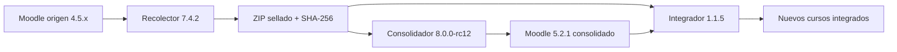

# Moodle Consolidation Toolkit

Toolkit CLI para **recolectar**, **consolidar** e **integrar** instancias Moodle en Linux/Ubuntu, con validaciones fail-closed, artefactos sellados, reanudación por checkpoints y evidencias auditables.

El flujo principal del proyecto está orientado a migrar orígenes Moodle 4.5.x hacia un destino Moodle 5.2.1 nuevo y, cuando corresponda, agregar posteriormente nuevos lotes mediante el Integrador Incremental.

## Estado actual

| Herramienta | Versión actual | Estado | Propósito |
|---|---:|---|---|
| Recolector Moodle | `7.4.2-linux` | Estable | Exportar una instancia origen sin modificarla |
| Consolidador Moodle | `8.0.0-linux-rc12` | Candidata final de cierre técnico, validada E2E | Construir un Moodle 5.2.1 nuevo a partir de múltiples fuentes |
| Integrador Incremental Moodle | `1.1.5-linux` | Estable | Agregar posteriormente un paquete a un destino consolidado |

> La línea V8 del Consolidador fue validada de extremo a extremo con los paquetes de aceptación reales. Conserva la etiqueta `rc12` porque `VERSION.txt` la identifica como candidata final de cierre técnico.

El Integrador `1.1.5-linux` permanece como la última versión estable de su línea. Su compatibilidad fue validada originalmente con la línea 7.x del Consolidador; **no se declara una revalidación completa contra V8 en este ciclo**.

## Flujo general


```mermaid
flowchart LR
    A["Moodle origen 4.5.x"] --> B["Recolector 7.4.2"]
    B --> C["ZIP sellado + SHA-256"]
    C --> D["Consolidador 8.0.0-rc12"]
    D --> E["Moodle 5.2.1 consolidado"]

    C --> F["Integrador 1.1.5"]
    E --> F
    F --> G["Nuevos cursos integrados"]
```

## Qué herramienta utilizar

| Necesidad | Herramienta |
|---|---|
| Extraer cursos, identidades, plugins, archivos y datos académicos de un Moodle origen | Recolector |
| Crear un Moodle destino nuevo a partir de varias instancias | Recolector en cada origen → Consolidador |
| Agregar posteriormente otro lote a un Moodle ya consolidado | Recolector → Integrador Incremental |
| Sincronizar continuamente dos Moodles | Fuera del alcance |
| Modificar cursos ya migrados como mecanismo de sincronización | Fuera del alcance |

## Estructura actual del repositorio

```text
moodle-consolidation-toolkit/
├── Consolidador/
│   ├── Consolidador-v8.0.0/
│   ├── Consolidador-v8.0.0-linux.zip
│   └── README.md
├── Recolector/
│   ├── Recolector-v7.4.2/
│   ├── Recolector-v7.4.2-linux-corregido.zip
│   └── README.md
├── Integrador/
│   └── Integrador-Incremental-Moodle-v1.1.5-linux/
└── README.md
```

No mezcle scripts entre herramientas ni ejecute una herramienta desde el directorio de otra.

## Compatibilidad

| Productor | Consumidor | Estado |
|---|---|---|
| Moodle `4.5.x` | Recolector `7.4.2-linux` | Soportado |
| Recolector `7.4.2-linux` | Consolidador `8.0.0-linux-rc12` | Recomendado |
| Recolector `7.4.1-linux` | Consolidador V8 | Compatible como paquete legacy; sin inventario completo de themes |
| Recolector `7.4.1-linux` | Integrador `1.1.5-linux` | Compatibilidad estable histórica |
| Consolidador `7.3.x` | Integrador `1.1.5-linux` | Compatibilidad validada históricamente |
| Consolidador `8.0.0-linux-rc12` | Integrador `1.1.5-linux` | No revalidado completamente en este ciclo |

El contrato de paquetes de origen sigue siendo `moodle-consolidation-source` sellado. V8 recomienda Recolector `7.4.2` para disponer de `theme_inventory=1.0`.

## Inicio rápido

### 1. Recolectar una instancia

Desde el repositorio:

```bash
cd Recolector/Recolector-v7.4.2
chmod +x EXPORTAR-ORIGEN.sh VALIDAR-PAQUETE.sh
```

Ejemplo:

```bash
sudo ./EXPORTAR-ORIGEN.sh \
  --background \
  --workers=auto \
  --output-dir=/mnt/exportaciones \
  pregrado \
  /srv/moodle/config.php
```

Resultado esperado:

```text
/mnt/exportaciones/pregrado.zip
/mnt/exportaciones/pregrado.zip.sha256
/mnt/exportaciones/pregrado.status.json
/mnt/exportaciones/logs/...
```

Validación exhaustiva opcional:

```bash
./VALIDAR-PAQUETE.sh \
  /mnt/exportaciones/pregrado.zip \
  /srv/moodle/config.php
```

No entregue el paquete al Consolidador hasta que el ZIP y su sello externo estén completos.

### 2. Crear un destino consolidado

Desde el repositorio:

```bash
cd Consolidador/Consolidador-v8.0.0
chmod +x ./*.sh
```

Coloque entre 2 y 32 paquetes de origen en `copias/`, cada uno acompañado por su `nombre.zip.sha256`.

Preparación:

```bash
./moodle-consolidation.sh verificar
./CONFIGURAR.sh
./PREPARAR-DESTINO.sh
```

Ejecución interactiva:

```bash
./INICIAR-CONSOLIDACION.sh --workers=auto
```

Ejecución reanudable en segundo plano:

```bash
./INICIAR-SEGUNDO-PLANO.sh --workers=auto
```

Supervisión:

```bash
./ESTADO.sh
./moodle-consolidation.sh logs
```

La herramienta conserva checkpoints y reanuda desde el primer punto no aprobado.

### 3. Integración incremental

La versión actual permanece en:

```text
Integrador/Integrador-Incremental-Moodle-v1.1.5-linux/
```

Consulte su README antes de utilizarla sobre un destino V8. La versión `1.1.5-linux` no fue revalidada integralmente contra RC12 durante este ciclo.

## Validación E2E del Consolidador RC12

La prueba definitiva de aceptación se ejecutó con dos fuentes:

| Métrica | Resultado observado |
|---|---:|
| Fuentes | 2 |
| Cursos planificados | **366** |
| Posgrados | 255 cursos |
| Pregrado | 111 cursos |
| Entrada Posgrados | 160.50 GiB |
| Entrada Pregrado | 5.75 GiB |
| Entrada total | **166.25 GiB** |
| Entorno | 4 vCPU / 15 GiB RAM |
| Tiempo de pared hasta cierre funcional | **3 h 2 min 47 s** |
| Tiempo activo acumulado de etapas hasta Fase 15 | **2 h 13 min 41 s** |
| Throughput observado sobre tiempo activo | **≈164 cursos/h** |
| Throughput de datos sobre tiempo activo | **≈74.6 GiB/h** |
| Fase 13, primer intento | 1 h 46 min 50 s → `waiting_manual` |
| Fase 13, reanudación | 9 min 36 s → `completed` |
| Verificación global | 16 s |
| Cierre funcional | 1 s |

El tiempo de pared incluye pausas del operador, revisión de estados, intervención y tiempo hasta ordenar el reintento. El tiempo activo corresponde a la suma de las etapas registradas por el asistente.

La ejecución completó:

```text
13-aplicar-lote        completed
13b-themes-lote        completed
14-verificar-lote      completed
15-cierre              completed
```

La Fase 16 intentó generar la copia integral posterior, pero quedó bloqueada después de 39 minutos por falta de espacio en un filesystem raíz de aproximadamente 969 GiB.

Esto **no revierte ni modifica la consolidación ya aplicada y verificada**. Sin embargo, en RC12 el comando `PUBLICAR-SITIO.sh` continúa exigiendo una copia integral de Fase 16 sellada como condición previa de publicación. Por tanto:

- Fase 15 representa el cierre funcional y la evidencia consolidada.
- Fase 16 es la exportación integral posterior del destino.
- La copia integral requiere dimensionamiento adicional de almacenamiento.
- La publicación automatizada de RC12 exige completar Fase 16.

## Principios operativos

- El Recolector trabaja en modo de solo lectura sobre el Moodle origen.
- Los paquetes de origen son artefactos sensibles.
- El Consolidador crea un destino nuevo; no debe apuntarse a una instalación en producción que ya sea autoridad.
- Los ZIP se validan por contrato, estructura, manifiesto y sellos.
- Las identidades no se fusionan por aproximación sin evidencia y decisión auditable.
- Un fallo aislado de un curso puede quedar en `WAITING_MANUAL` sin descartar los checkpoints válidos del resto.
- El correo de progreso es observacional y fail-open.
- No se inventan plugins, themes, `google_sub`, usuarios o payloads académicos para “hacer pasar” una restauración.
- Los cursos restaurados se verifican antes de considerarse completados.

## Seguridad y archivos que no deben publicarse

No suba al repositorio:

```text
.env
config.php
copias/*.zip
*.zip.sha256 de fuentes institucionales
exports/ reales
reports/ reales
logs/
moodledata/
bases de datos
credenciales SMTP
tokens OAuth
API keys
backups institucionales
```

Los directorios de distribución incluyen `.gitignore`, `FILES.sha256` y plantillas sin secretos.

## Verificación de una distribución

Después de extraer una herramienta:

```bash
sha256sum -c FILES.sha256
```

Para un paquete producido por el Recolector:

```bash
sha256sum -c nombre.zip.sha256
```

La validación exhaustiva del Recolector puede recalcular también los hashes internos y comprobar la coherencia entre manifiesto, checkpoints, inventarios y MBZ.

## Alcance

Este toolkit automatiza una **migración y consolidación controlada**, no una sincronización continua.

La lógica se apoya en los mecanismos de backup/restore de Moodle y añade:

- conciliación de identidades;
- normalización de roles;
- compatibilidad de plugins;
- política de themes;
- validación OAuth2;
- restauración paralela reanudable;
- verificación académica incremental;
- evidencias y hashes;
- cierre auditable.

Para operación detallada, consulte los README de `Consolidador/` y `Recolector/`.
